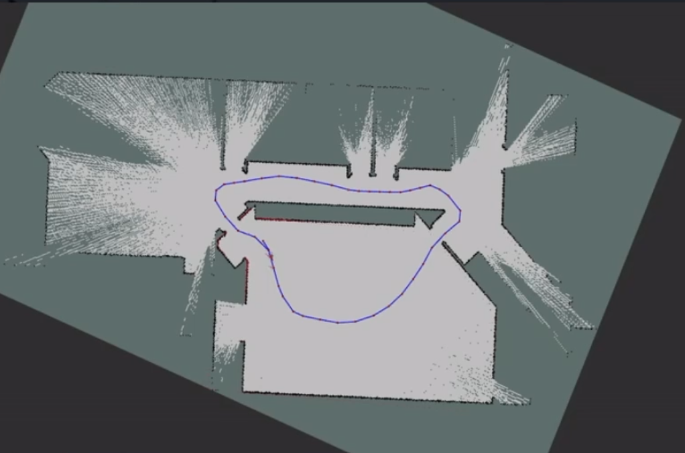
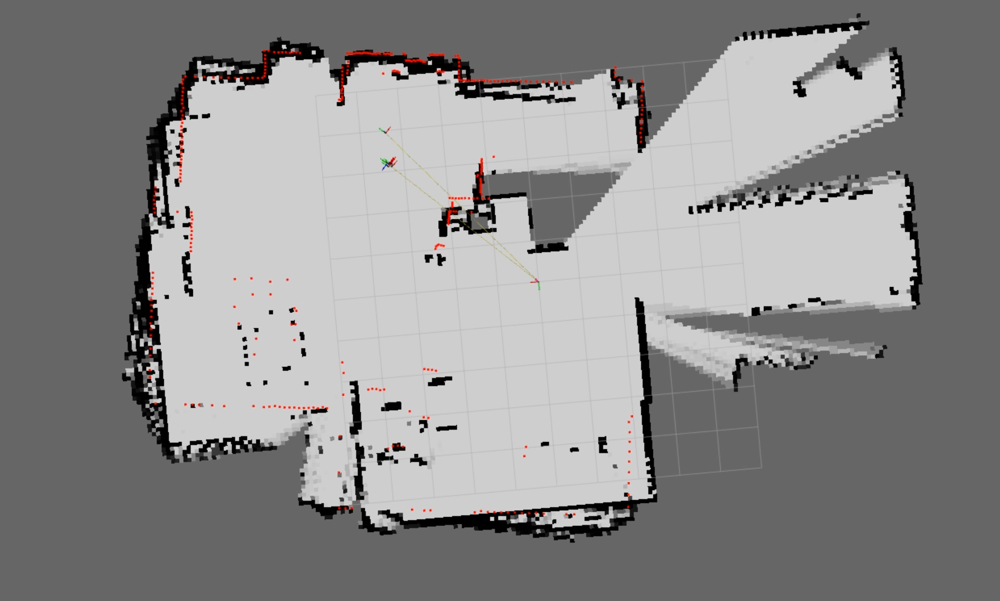

# amr_project
Implementation of a Autonomous mobile robot using Ros2

### Abstract
The aim of this project is to develop an autonomous navigation mobile robot (AMR) using Robot Operating System (ROS2), starting from building and controlling the robot intro developing an odometry motion model using sensor fusion algorithms using the {Extended Kalman Filter}, then exploring mapping and localization techniques and algorithms such as {Markov's Localization}, {Monte Carlo Localization},
    and finally Simultaneous Localization and Mapping -SLAM-.

### Results Summary 
<!--  -->

